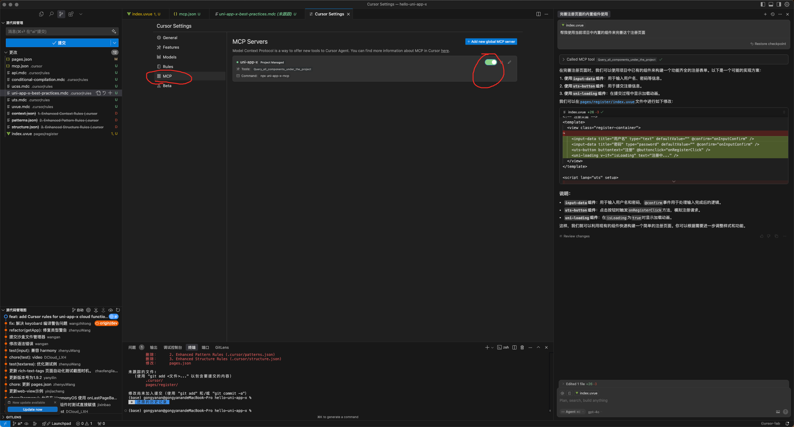
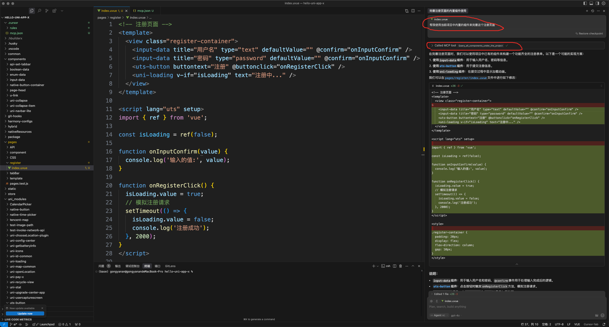

## 使用规则
复制.cursor下的rules目录到uni-app-x项目根目录下

## 使用mcp

#### 1、下载mcp包
```bash
$ npm i uni-app-x-mcp -g
```

#### 2、在Cursor中使用
在项目根路径创建.cursor/mcp.json文件，文件内容如下
```json
{
    "mcpServers": {
        "uni-app-x": {
            "command": "npx",
            "args": [
                "uni-app-x-mcp"
            ]
        }
    }
}
```

#### 3、默认启动mcp服务
- 点击cursor setting -> 点击mcp
- 会出现一个mcp列表，选择自己需要启动mcp就行(默认是关闭状态)


ps: 默认需要自己点击是否使用mcp服务，也可以设置为自动代理的方式[文档](https://docs.cursor.com/chat/agent#yolo-mode)

#### 使用方式

